# Chill Mode

Chill Mode is a Minecraft data pack that aims to create a better version of the peaceful difficulty. It allows you to play all of Minecraft, on any difficulty, without having to fight.

## Features

* No mobs are hostile\*
* Most monsters don't spawn
* Alternative ways to obtain mob drops
* Complete the game by breaking the end crystals

\*Note that [slimes, magma cubes, and pufferfish hurt the player passively when colliding with them](https://bugs.mojang.com/browse/MC/issues/MC-256096).

## Mob Drop Alternatives

### Bone

6 bones can be crafted from **2 bone blocks**.

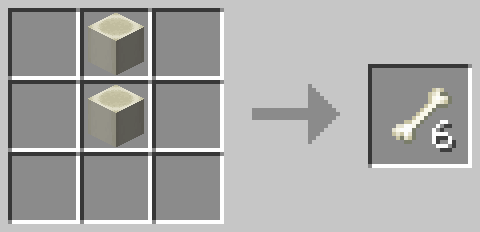

### Blaze Rod

Blaze rods can be obtained from **piglin bartering**. (Piglins spawn in **bastion remnants**.)

### Breeze Rod

1 breeze rod can be crafted from **1 blaze rod** and **1 wind charge** (shapeless).

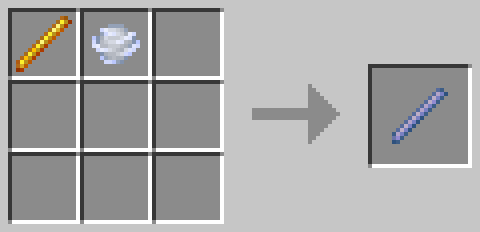

### Dragon's Breath

8 dragon's breath can be crafted from **8 glass bottles** and **1 dragon head**.

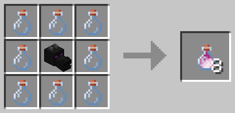

### Ender Pearl

Ender pearls can be obtained from **piglin bartering**, at double the normal amount. (Piglins spawn in **bastion remnants**.)

### Feather

Feathers have a chance to drop from **chickens laying eggs**.

### Froglights

1 ochre froglight can be crafted from **4 yellow dyes**, **4 papers**, and **1 glowstone**.

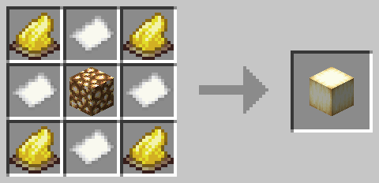

1 pearlescent froglight can be crafted from **4 purple dyes**, **4 papers**, and **1 glowstone**.

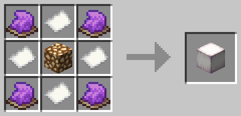

1 verdant froglight can be crafted from **4 lime dyes**, **4 papers**, and **1 glowstone**.

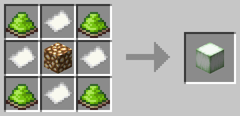

### Ghast Tear

1 ghast tear can be crafted from **1 crying obsidian** and **1 soul soil** (shapeless).

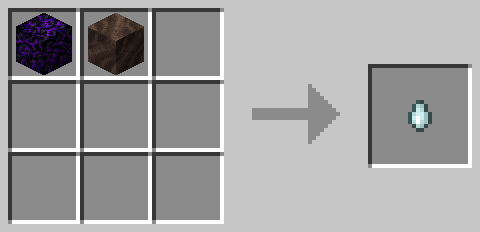

### Glow Ink Sac

1 glow ink sac can be crafted from **1 ink sac** and **1 glowstone dust** (shapeless).

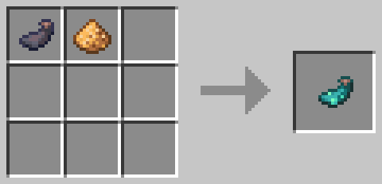

### Goat Horn

All goat horn variants can be found in **pillager outpost chests**.

### Gunpowder

Gunpowder has a chance to drop from **mining basalt**.

### Heads

Skeleton skulls can be obtained from **piglin bartering**. (Piglins spawn in **bastion remnants**.)

1 creeper head can be crafted from **1 skeleton skull** and **4 gunpowder**.

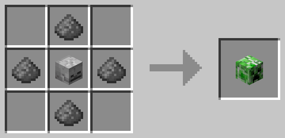

1 piglin head can be crafted from **1 skeleton skull** and **4 gold ingots**.

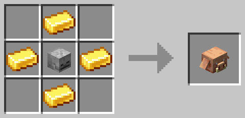

1 wither skeleton skull can be crafted from **1 skeleton skull** and **4 coals**.

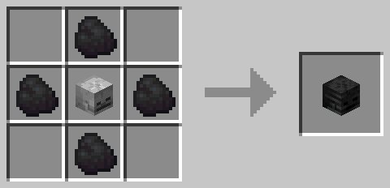

1 zombie head can be crafted from **1 skeleton skull** and **4 rotten flesh**.

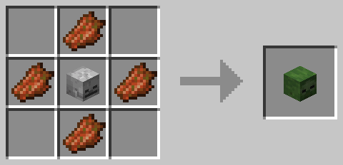

### Ink Sac

1 ink sac can be crafted from **1 water bucket** and **1 coal/charcoal** (shapeless).

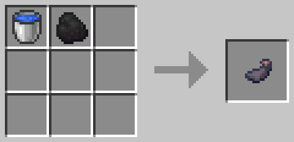

### Leather

1 leather can be crafted from **4 of any mushroom/fungus**.

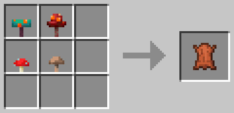

### Music Discs

1 "blocks" music disc can be crafted from **8 resin bricks** and **1 grass block**.

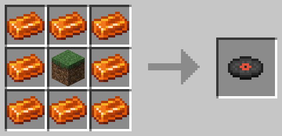

1 "chirp" music disc can be crafted from **8 resin bricks** and **1 torchflower**.

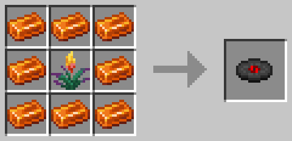

1 "far" music disc can be crafted from **8 resin bricks** and **1 bottle o' enchanting**.

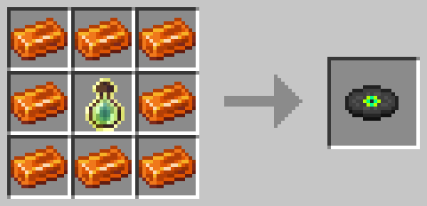

1 "Lava Chicken" music disc can be crafted from **8 resin bricks** and **1 zombie head**.

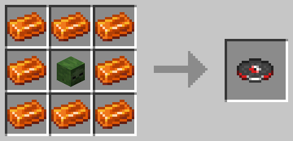

1 "mall" music disc can be crafted from **8 resin bricks** and **1 shulker shell**.

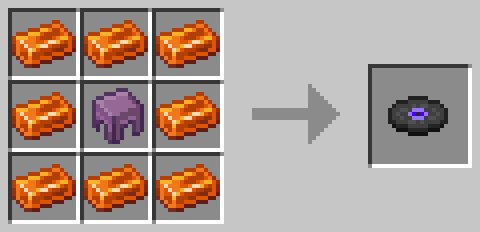

1 "mellohi" music disc can be crafted from **8 resin bricks** and **1 nautilus shell**.

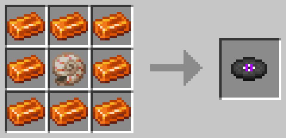

1 "stal" music disc can be crafted from **8 resin bricks** and **1 goat horn**.

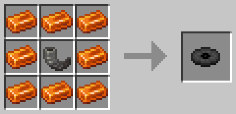

1 "strad" music disc can be crafted from **8 resin bricks** and **1 diamond horse armor**.

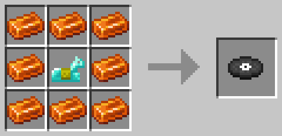

1 "Tears" music disc can be crafted from **8 resin bricks** and **1 dried ghast**.

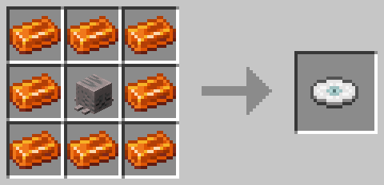

1 "wait" music disc can be crafted from **8 resin bricks** and **1 heart of the sea**.

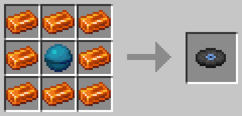

1 "ward" music disc can be crafted from **8 resin bricks** and **1 enchanted golden apple**.

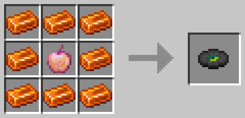

1 "11" music disc can be crafted from **8 resin bricks** and **1 wither skeleton skull**.

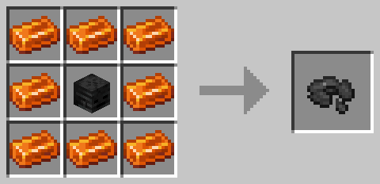

### Nether Star

1 nether star can be crafted from **4 glowstone dust**, **4 netherite ingots**, and **1 quartz**.

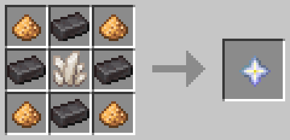

### Phantom Membrane

1 phantom membrane can be crafted from **9 popped chorus fruits**.

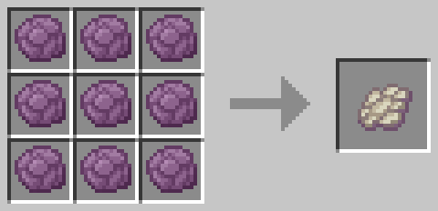

### Prismarine Shard

4 prismarine shards can be crafted from **1 prismarine**.

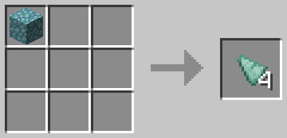

### Rabbit Foot

1 rabbit foot can be crafted from **1 rabbit hide** and **1 wool** (shapeless).

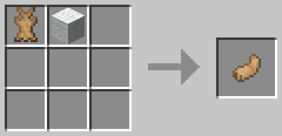

### Rabbit Hide

4 rabbit hides can be crafted from **1 leather**.

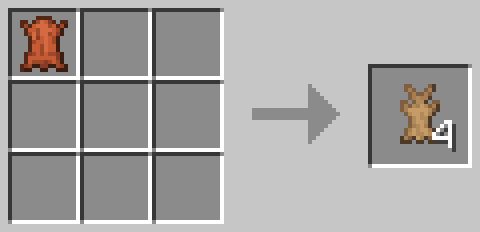

### Resin Clump

4 resin clumps can be crafted from **2 stripped pale oak logs** (shapeless).

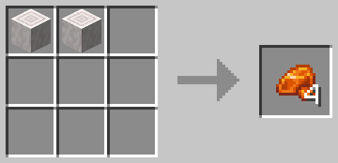

### Rotten Flesh

1 rotten flesh can be crafted from **1 of any meat** and **1 poisonous potato** (shapeless).

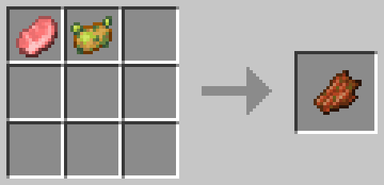

### Shulker Shell

1 shulker shell can be crafted from **5 purpur blocks** and **1 diamond**.

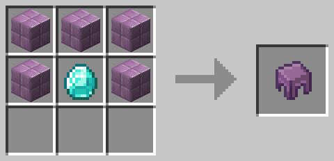

### Slime Ball

1 slime ball can be crafted from **1 honey bottle**, **1 wheat**, and **1 lime dye** (shapeless).

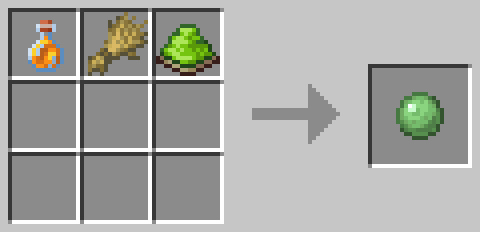

### Spider Eye

Spider eyes have a chance to drop from **breaking cobwebs**.

### String

4 strings can be crafted from **1 wool**.

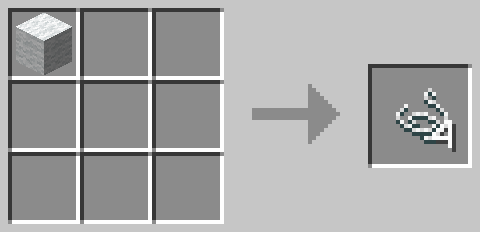

### Tide Armor Trim

Tide armor trim smithing templates can be obtained from **fishing**.

### Totem of Undying

1 totem of undying can be crafted from **8 golden apples** and **1 enchanted golden apple**.

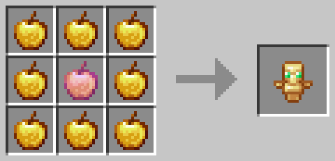

### Trial Keys

Trial keys can be obtained from **trial chamber pots**, at a higher chance and amount than normal.

1 ominous trial key can be crafted from **1 trial key** and **1 ominous bottle** (shapeless).

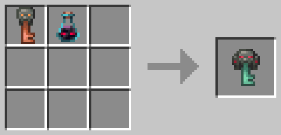

### Trident

1 trident can be crafted from **3 prismarine shards** and **2 diamonds**.

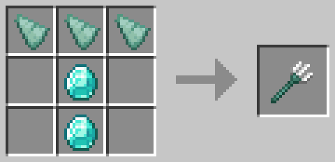

### Wither Rose

1 wither rose can be crafted from **1 of any small flower** and **1 wither skeleton skull** (shapeless).

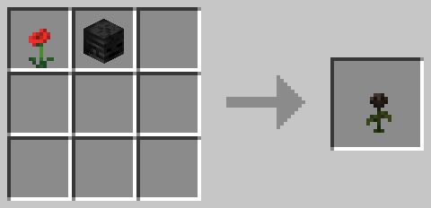
